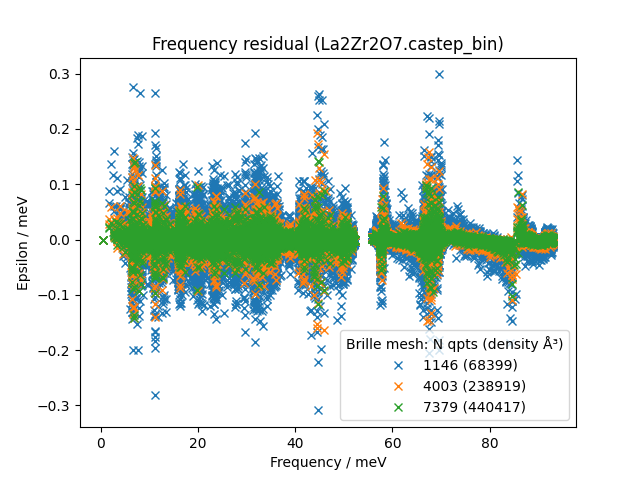
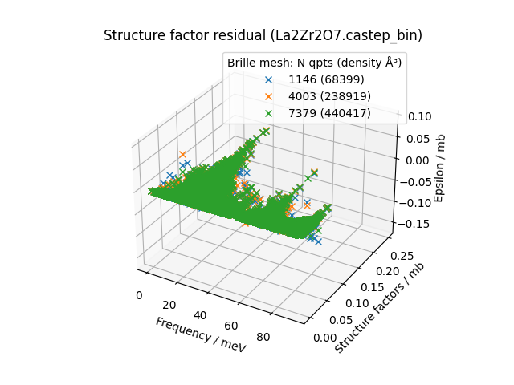
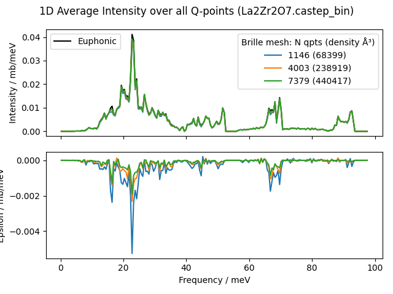
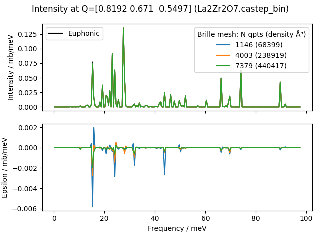

.. _brille-convergence-script:

===========================
euphonic-brille-convergence
===========================

.. highlight:: bash

The ``euphonic-brille-convergence`` program is useful for determining grid density or number of grid points that should be used in :py:meth:`BrilleInterpolator.from_force_constants <euphonic.brille.BrilleInterpolator.from_force_constants>` to achieve the desired accuracy.
It requires a force constants file as input. By default will create a Brille trellis grid with approximately 5000 grid points, and use this grid to calculate q-point frequencies and eigenvectors at 1000 quasirandom q-points, comparing these to the Euphonic-calculated frequencies and eigenvectors for the same 1000 points.
The comparison is shown in 3 figures:

* A scatter plot showing the difference between Euphonic-interpolated and Brille-interpolated frequencies (the frequency residual)
* A 3D scatter plot showing the difference between the structure factors calculated from the Euphonic-interpolated and Brille-interpolated frequencies and eigenvectors (the structure factor residual)
* A line plot with 2 axes. The top axis is a line plot of the 1D-averaged intensity calculated from the Euphonic-interpolated and Brille-interpolated frequencies and eigenvectors for the 1000 quasirandom q-points. The bottom axis shows the difference between the Euphonic 1D average and the Brille 1D average (the residual).

Additionally, there may some extra figures, depending on the value of the ``-n`` argument (default 0):

* A line plot with 2 axes. The top axis shows a line plot of the intensity for a particular q-point (not 1D-averaged) calculated from the Euphonic-interpolated and Brille-interpolated frequencies and eigenvectors. The bottom axis shows the difference between the Euphonic intensity and the Brille intensity (the residual).

The ``--brille-npts`` or ``--brille-npts-density`` arguments can be used to change the number or number density of Brille grid points respectively.
Note that one or the other should be used, not both.
Multiple values can be used for each of these to see the convergence between Euphonic-interpolated and Brille-interpolated values as the number of Brille grid points changes, so can be used to decide which is sufficient for the required accuracy.
Each provided value will add an extra series to the figures above.

An example for La2Zr2O7 showing 1 extra figure and 3 different Brille grid sizes is shown below::
   
   euphonic-brille-convergence La2Zr2O7.castep_bin -n 1 --brille-npts 500 2500 5000

         Euphonic-interpolated and Brille-interpolated frequencies for
         1000 quasirandom q-points. There are 3 series, one for each
         Brille grid size of 500, 2500 and 5000 points. The residuals
         are smaller for larger Brille grid sizes.

         structure factors calculated from Euphonic-interpolated and
         Brille-interpolated frequencies and eigenvectors for
         1000 quasirandom q-points for Brille grid sizes of 500, 2500
         and 5000 points.

         showing the scattering intensity 1D-averaged over 1000
         quasirandom q-points for Euphonic and Brille. There are 4
         series, one for Euphonic and one for each Brille grid size of
         500, 2500 and 5000 points. The bottom axis is a line plot
         showing the difference between the Brille intensity and
         Euphonic intensity for each grid size, so has 3 series.

         scattering intensity for a particular q-point for Euphonic
         and Brille. There are 4 series, one for Euphonic and one for
         each Brille grid size of 500, 2500 and 5000 points. The bottom
         axis is a line plot showing the difference between the Brille
         intensity and Euphonic intensity for each grid size, so has 3
         series.

To see all the command line options, run::

   euphonic-brille-convergence -h

You can also see the available command line options below.
For more information on how Euphonic and Brille work together, see see :ref:`Brille Interpolator <brille-interpolator>`.

Command Line Options
--------------------

.. argparse::
   :module: euphonic.cli.brille_convergence
   :func: get_parser
   :prog: euphonic-brille-convergence
