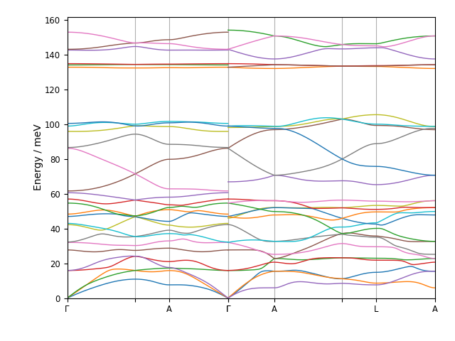
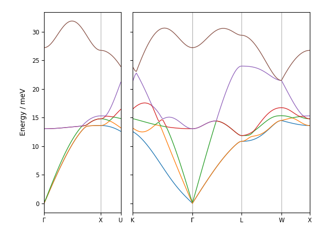

.. _disp-script:

===================
euphonic-dispersion
===================

.. highlight:: bash

The ``euphonic-dispersion`` program can be used to plot dispersion
either along a specific trajectory from precalculated phonon frequencies,
or along a recommended reciprocal space path from force constants. For
example, to plot from a Euphonic ``.json`` file containing
``QpointPhononModes``, with frequencies reordered to follow equivalent modes
across Q, and the y-axis minimum energy set to 0 meV, run::

   euphonic-dispersion quartz_qpoint_phonon_modes.json --reorder --e-min 0

Or, to plot along a recommended q-point path from Phonopy force constants
with an acoustic sum rule, run::

   euphonic-dispersion NaCl/phonopy.yaml --asr reciprocal

To see all the command line options, run::

   euphonic-dispersion -h

You can also see the available command line options below.
For information on advanced plot styling, see :ref:`styling`.

Command Line Options
--------------------

.. argparse::
   :module: euphonic.cli.dispersion
   :func: get_parser
   :prog: euphonic-dispersion
