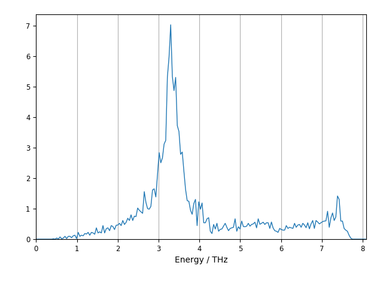
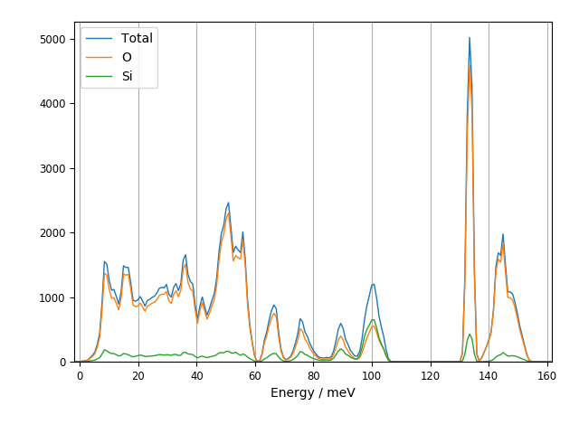

.. _dos-script:

============
euphonic-dos
============

.. highlight:: bash

The ``euphonic-dos`` program can be used to plot density of states,
partial density of states, and/or neutron-weighted density of states.
It can use pre-calculated frequencies, or use force constants to
generate frequencies and DOS over a Monkhorst-Pack grid. For example,
to plot DOS from a Phonopy ``mesh.yaml`` file in units of THz, run::

   euphonic-dos NaCl/mesh.yaml --energy-unit THz

         of THz

Or, to plot coherent neutron-weighted DOS from CASTEP force constants in a
``.castep_bin`` file on a 15x15x12 grid with 1.5 meV broadening, run::

   euphonic-dos quartz.castep_bin --weighting coherent-dos --grid 15 15 12 --energy-broadening 1.5

         for PDOS of Silicon and Oxygen and a line for the total DOS.
         Each DOS has been broadened by 1.5 meV and the x-axis is in
         default energy units of meV.

To see all the command line options, run::

   euphonic-dos -h

You can also see the available command line options below.
For information on advanced plot styling, see :ref:`styling`.

Command Line Options
--------------------

.. argparse::
   :module: euphonic.cli.dos
   :func: get_parser
   :prog: euphonic-dos
