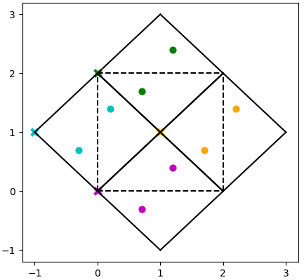
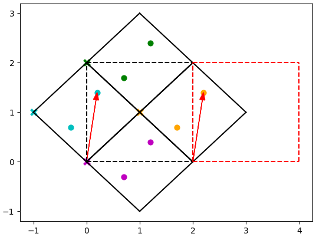

.. _force-constants:

ForceConstants
==============

The ``ForceConstants`` object contains the force constants, supercell, and
crystal structure information required to calculate phonon frequencies and
eigenvectors at any arbitrary q via Fourier interpolation. 

.. contents:: :local:

.. _fc_format:

Force Constants Format
----------------------

**Description**

The :py:attr:`ForceConstants.force_constants <euphonic.force_constants.ForceConstants.force_constants>` attribute contains the force constants matrix

.. math::

  \phi_{\alpha, {\alpha}'}^{\kappa, {\kappa}'} =
  \frac{\delta^{2}E}{{\delta}u_{\kappa,\alpha}{\delta}u_{{\kappa}',{\alpha}'}}

This describes the change in total energy when atom :math:`\kappa` is displaced in direction :math:`\alpha` and atom :math:`\kappa\prime` is displaced in direction :math:`\alpha\prime`.
In Euphonic the force constants are stored in 'compact' form, which means that the minimum required information is stored.
Using equivalent vectors, the force constants between every atom in the unit cell, and every atom in the supercell are all that is needed,
so only :math:`N(3n)^2` values need to be stored rather than :math:`(3Nn)^2` as in the 'full' square force constants matrix,
where N is the number of unit cells in the supercell, and n is the number of atoms in the unit cell.

**Shape and Indexing**

The force constants matrix has shape ``(N, 3*n, 3*n)``, where N is the number of unit cells in the supercell, and n is the number of atoms in the unit cell.
The force constants index ``[a, l, m]``, where ``l = 3*kappa + alpha`` and ``m = 3*kappa_prime + alpha_prime``,
describes the change in energy when atom ``kappa`` in unit cell ``0`` is displaced in direction ``alpha`` and atom ``kappa_prime`` in unit cell ``a`` is displaced in direction ``alpha_prime``.
For example, ``ForceConstants.force_constants[5, 8, 1]`` is the change in energy when atom
``2`` in unit cell ``0`` is displaced in the ``z`` direction
and atom ``0`` in unit cell ``5`` is displaced in the ``y`` direction.

**Phase Convention**

To calculate phonon frequencies and eigenvectors, the dynamical matrix at wavevector :math:`q` must be calculated.
This is calculated by taking a Fourier transform of the force constants matrix

.. math::

  D_{\alpha, {\alpha}'}^{\kappa, {\kappa}'}(q) =
  \frac{1}{\sqrt{M_\kappa M_{\kappa '}}}
  \sum_{a}\phi_{\alpha, \alpha '}^{\kappa, \kappa '}e^{-iq\cdot r_a}

The :math:`q\cdot r_a` component is the phase, and in Euphonic's convention :math:`r_a` is defined as the origin coordinate of unit cell :math:`a` in the supercell.
For this reason the cell origin coordinates are required as input to create a :py:attr:`ForceConstants <euphonic.force_constants.ForceConstants>` object.
For force constants from programs that use the same phase convention (such as CASTEP), this information is usually provided so is straightforward.

Force constants which come from programs where the phase is defined as :math:`q\cdot r_k` using the coordinate of each atom (such as Phonopy) are likely to need to be reshaped to be compatible with Euphonic, and the cell origins are not usually provided.
If the unit cell and supercell are commensurate (i.e. the supercell matrix is diagonal), calculation of the cell origins and reshaping the force constants matrix should be trivial.
However, if the unit and supercell are incommensurate there may be some reindexing required to get the force constants in the correct format.
See the example below, which shows a 2D system with the following properties:

* Cartesian unit cell vectors: ``[1, 1], [1, -1]``
* Fractional atom coordinates: ``[0.8, 0.4], [0.2, 0.5]``
* Supercell matrix: ``[[1, -1], [1, 1]]``

         supercell contains atoms from all 4 unit cells.

The solid line shows the unit cells, and the dashed line shows the supercell.
The atoms are coloured depending on the unit cell they belong to.
It can be seen that the supercell contains atoms from 4 different unit cells.
There would therefore be 4 different cell origins, shown by the corresponding coloured crosses.
However, there are actually only 2 unit cells in the supercell, and Euphonic requires that the number of cell origins is the same as the number of unit cells.
Using equivalent vectors in adjacent supercells, the 4 atoms in the supercell can be assigned to just 2 cell origins.
For example, if we decided to use the origins of the magenta cell (``[0, 0]``) and orange cell (``[1, 1]``), the blue and green atoms would have to be indexed into these 2 cell origins.
The way to do this can be seen in the example below:

         in adjacent supercells

The vector from ``[0, 0]`` to the blue atom is the same as the vector from ``[2, 0]`` to an atom in the orange cell in the adjacent supercell (shown by the red dashed line).
The blue atom can therefore be indexed into the orange cell.
Similarly the green atom can be indexed into the magenta cell, so only 2 cell origins are required.
This is a simple example, but the same applies to more realistic 3D structures.

This transformation is done automatically when reading from Phonopy.
If reading force constants from another program, there is a function to help with this transformation, see :ref:`Reading From Other Programs<fc_read_other_programs>`.

Reading From CASTEP
-------------------

The force constants matrix and other required information can be read from a
``.castep_bin`` or ``.check`` file with
:py:meth:`ForceConstants.from_castep <euphonic.force_constants.ForceConstants.from_castep>`:

.. code-block:: py

  from euphonic import ForceConstants

  filename = 'quartz/quartz.castep_bin'
  fc = ForceConstants.from_castep(filename)

By default CASTEP may not write the force constants, if you receive an error
saying the force constants could not be read, in the ``.param`` file ensure a
``PHONON_FINE_METHOD`` has been chosen e.g. ``PHONON_FINE_METHOD: interpolate``,
and set ``PHONON_WRITE_FORCE_CONSTANTS: true``, then rerun CASTEP to trigger the
force constants to be written.

Reading From Phonopy
--------------------

When using Phonopy with Euphonic, it is recommended that all the required data
(force constants, crystal structure, born charges if applicable) be collected
in a single ``phonopy.yaml`` file. This can be done by running Phonopy with the
``--include-all`` flag or with ``INCLUDE_ALL = .TRUE.``
(``phonopy >= 2.5.0 only``).

Required information is read from Phonopy output files using
:py:meth:`ForceConstants.from_phonopy <euphonic.force_constants.ForceConstants.from_phonopy>`.
A path keyword argument can be supplied (if the files are in another
directory), and by default ``phonopy.yaml`` is read, but the filename can be
changed with the ``summary_name`` keyword argument:

.. code-block:: py

  from euphonic import ForceConstants

  fc = ForceConstants.from_phonopy(path='NaCl',
                                   summary_name='phonopy_fc.yaml')

If you are using an older version of Phonopy, the force constants and born
charges can also be read from Phonopy plaintext or hdf5 files by specifying the
``fc_name`` and ``born_name`` keyword arguments:

.. code-block:: py

  from euphonic import ForceConstants

  fc = ForceConstants.from_phonopy(path='NaCl',
                                   fc_name='force_constants.hdf5',
                                   born_name='BORN')

.. _fc_read_other_programs:

Reading From Other Programs
---------------------------

A Euphonic :py:attr:`ForceConstants <euphonic.force_constants.ForceConstants>` object can be created from arbitrary force constants and crystal information if they can be provided as Numpy arrays.
If the force constants are in the same form and shape as descibed in the :ref:`Force Constants Format<fc_format>` section, they can simply be used in the :py:attr:`ForceConstants <euphonic.force_constants.ForceConstants>` object constructor.
The crystal information must be provided as a :py:attr:`Crystal <euphonic.crystal.Crystal>` object, which can similarly be created using the class constructor.
Some information must be provided as a pint ``Quantity`` with both a magnitude and a unit (see :ref:`Units<units>`).
For more details on the shape of each array, see the docstrings for each object.
An example is shown below, assuming that the inputs are being loaded from existing ``.npy`` files:

.. code-block:: py

  import numpy as np
  from euphonic import ureg, Crystal, ForceConstants

  # Load arrays from files and apply any required units
  cell_vectors = np.load('cell_vectors.npy')*ureg('angstrom')
  atom_r = np.load('atom_r.npy')
  atom_type = np.load('atom_type.npy')
  atom_mass = np.load('atom_mass.npy')*ureg('amu')
  force_constants = np.load('force_constants.npy')*ureg('meV/(angstrom**2)')
  sc_matrix = np.load('sc_matrix.npy')
  cell_origins = np.load('cell_origins.npy')

  # Create a Crystal object
  crystal = Crystal(cell_vectors, atom_r, atom_type, atom_mass)
  # Create a ForceConstants object, using the Crystal object
  fc = ForceConstants(crystal, force_constants, sc_matrix, cell_origins)

If, as described in the :ref:`Force Constants Format<fc_format>` section, the source program uses the atomic coordinate phase convention, there may be some re-indexing required to get the force constants in the correct shape and form.
There is a helper function :py:meth:`euphonic.util.convert_fc_phases <euphonic.util.convert_fc_phases>`
which will convert a force constants of shape ``(n, N*n, 3, 3)``, to the shape required by Euphonic ``(N, 3*n, 3*n)``,
will do any re-indexing required, and will return the appropriate cell origins, even if the supercell matrix is non-diagonal.
All that is required are the coordinates of the atoms in the unit cell and supercell respectively,
the supercell matrix, and information on how atoms in the unit cell index into the supercell and vice versa.
For more details see the function docstring. An example is below:

.. code-block:: py

  import numpy as np
  from euphonic import ureg, Crystal, ForceConstants
  from euphonic.util import convert_fc_phases

  # Load arrays from files and apply any required units
  cell_vectors = np.load('cell_vectors.npy')*ureg('angstrom')
  atom_r = np.load('atom_r.npy')
  atom_type = np.load('atom_type.npy')
  atom_mass = np.load('atom_mass.npy')*ureg('amu')
  sc_matrix = np.load('sc_matrix.npy')

  # Load arrays from files required for convert_fc_phases
  force_constants_atomic_phase = np.load('force_constants_atomic_phase.npy')
  supercell_atom_r = np.load('supercell_atom_r.npy')
  unit_to_supercell_atom_idx = np.load('unit_to_supercell_atom_idx.npy')
  super_to_unit_cell_atom_idx = np.load('super_to_unit_cell_atom_idx.npy')
  # Convert force constants to Euphonic shape and convention
  force_constants, cell_origins = convert_fc_phases(
      force_constants_atomic_phase,
      atom_r,
      supercell_atom_r,
      unit_to_supercell_atom_idx,
      super_to_unit_cell_atom_idx,
      sc_matrix)
  # Apply units to force constants
  force_constants = force_constants*ureg('meV/(angstrom**2)')

  # Create a Crystal object
  crystal = Crystal(cell_vectors, atom_r, atom_type, atom_mass)
  # Create a ForceConstants object, using the Crystal object
  fc = ForceConstants(crystal, force_constants, sc_matrix, cell_origins)

Once the force constants object has been created, it can be saved as a single portable JSON file using
:py:meth:`ForceConstants.to_json_file <euphonic.force_constants.ForceConstants.to_json_file>`

Calculating Phonon Frequencies and Eigenvectors
-----------------------------------------------

Phonon frequencies and eigenvectors are calculated using
:py:meth:`ForceConstants.calculate_qpoint_phonon_modes <euphonic.force_constants.ForceConstants.calculate_qpoint_phonon_modes>`
(see the docstring for algorithm details). A Numpy array of q-points of shape
(n_qpts, 3) must be provided, and a
:ref:`QpointPhononModes<qpoint-phonon-modes>` object is returned. A
recommended q-point path for plotting bandstructures can be generated using
`seekpath <https://seekpath.readthedocs.io/en/latest/module_guide/index.html#seekpath.getpaths.get_explicit_k_path>`_:

.. code-block:: py

  import seekpath
  import numpy as np
  from euphonic import ForceConstants

  # Read quartz data from quartz.castep_bin
  filename = 'quartz/quartz.castep_bin'
  fc = ForceConstants.from_castep(filename)

  # Generate a recommended q-point path using seekpath
  cell = fc.crystal.to_spglib_cell()
  qpts = seekpath.get_explicit_k_path(cell)["explicit_kpoints_rel"]

  # Calculate frequencies/eigenvectors
  phonons = fc.calculate_qpoint_phonon_modes(qpts, asr='reciprocal')

Calculating Phonon Frequencies Only
-----------------------------------

This uses the same algorithm as for calculating both the frequencies and
eigenvectors, only with lower memory requirements as the eigenvectors
are not stored. This is done using
:py:meth:`ForceConstants.calculate_qpoint_frequencies <euphonic.force_constants.ForceConstants.calculate_qpoint_frequencies>`
which returns a :ref:`QpointFrequencies<qpoint-frequencies>` object.

Docstring
---------

.. autoclass:: euphonic.force_constants.ForceConstants
   :members:
   :exclude-members: force_constants, born, dielectric
