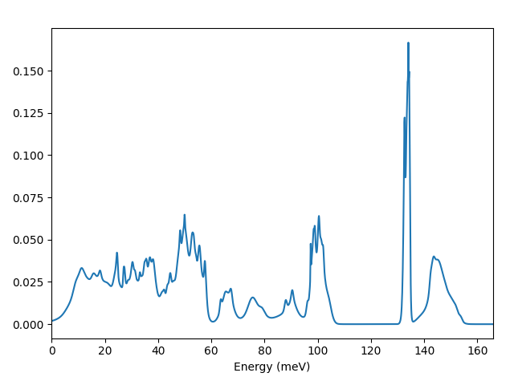
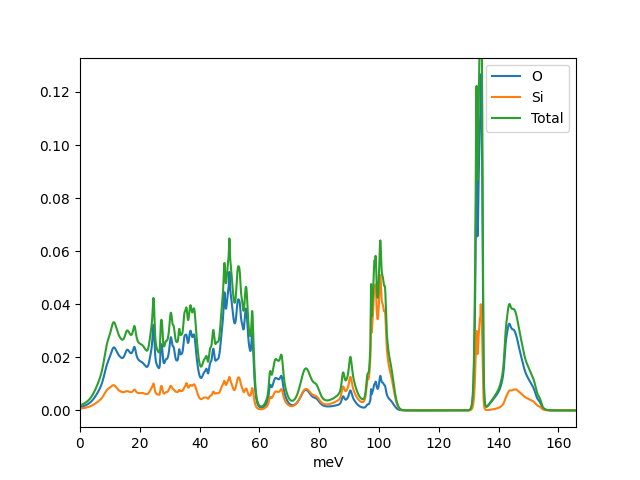
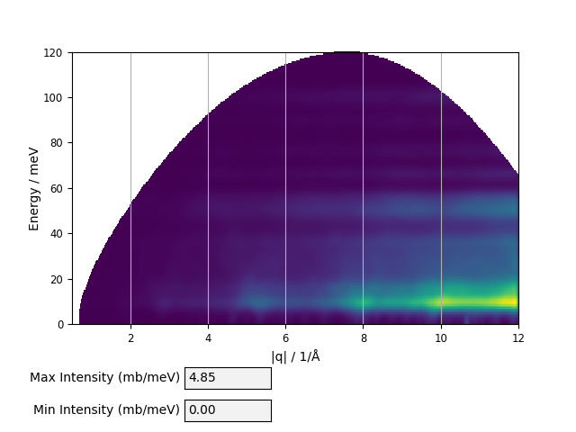

Introduction
************

Euphonic enables the quick simulation of phonons from a force constants matrix produced by many common simulation packages.
By default it supports the output from CASTEP or Phonopy, but it is possible to load any other format with just a little more work.
This guide will describe how to perform many common Euphonic operations.
It is not intended to describe every possible operation you could perform.
We have tried to provide links to the API documentation for the most complex cases.
If you need extra help please feel free to contact us at euphonic@stfc.ac.uk.
This guide assumes a basic level of proficiency with Python, Numpy and Matplotlib.
If you do not know what those are you might want to look them up first!

.. contents:: :local:

Checking Euphonic Is Installed
==============================

In your Python console type:

.. testcode:: euphonic_version

  import euphonic as eu
  print(eu.__version__)

.. testoutput:: euphonic_version
  :hide:

  ...

It should output the version, such as:

.. code-block:: python

  1.1.0

If the version isn't what you expect, you may need to update or install Euphonic.
You can view the different versions in the :ref:`Changelog<changelog>`, or see instructions on how to install Euphonic at :ref:`Installation<installation>`.

Loading Data
============

If you have the force constants matrix in a ``.castep_bin`` file then to load it into Euphonic:

.. testsetup:: quartz_castep

  import euphonic as eu
  fnames = 'quartz.castep_bin'
  shutil.copyfile(get_castep_path('quartz', fnames), fnames)

.. testsetup:: quartz_extra_setup

  import numpy as np
  import euphonic.util as util
  import euphonic as eu
  fnames = 'quartz.castep_bin'
  shutil.copyfile(get_castep_path('quartz', fnames), fnames)
  fc = eu.ForceConstants.from_castep('quartz.castep_bin')

  phonons, mode_grads=fc.calculate_qpoint_phonon_modes(
      util.mp_grid([5, 5, 4]), return_mode_gradients=True)
  mode_widths = util.mode_gradients_to_widths(
      mode_grads, fc.crystal.cell_vectors)
  energy_bins = np.arange(0, 166, 0.1)*eu.ureg('meV')

.. testcode:: quartz_castep

  fc = eu.ForceConstants.from_castep('quartz.castep_bin')

For Phonopy, if the default filename of ``phonopy.yaml`` has been used and it is in your current directory then:

.. testsetup:: phonopy_default

  import euphonic as eu
  fnames = 'phonopy.yaml'
  shutil.copyfile(get_phonopy_path('NaCl', 'phonopy_nacl.yaml'), fnames)

.. testcode:: phonopy_default

  fc = eu.ForceConstants.from_phonopy()

If it has been renamed then:

.. testsetup:: phonopy_rename

  import euphonic as eu
  fnames = 'quartz.yaml'
  shutil.copyfile(get_phonopy_path('NaCl', 'phonopy_nacl.yaml'), fnames)

.. testcode:: phonopy_rename

  fc = eu.ForceConstants.from_phonopy(summary_name='quartz.yaml')

If an old version of Phonopy with separate files for the force constants and Born charges then:

.. testsetup:: phonopy_separate_files

  import euphonic as eu
  fnames = ['phonopy.yaml', 'BORN', 'force_constants.hdf5']
  from_fnames = ['phonopy_nofc_noborn.yaml', 'BORN_nacl', 'force_constants.hdf5']
  for fname, ffname in zip(fnames, from_fnames):
      shutil.copyfile(get_phonopy_path('NaCl', ffname), fname)

.. testcode:: phonopy_separate_files

  fc = eu.ForceConstants.from_phonopy(fc_name='force_constants.hdf5',
                                      born_name='BORN')

.. testoutput:: phonopy_separate_files
  :hide:

  ...

For systems where you do not have a standard CASTEP/Phonopy file format, you must load all your system information into Numpy arrays which can then be used to initialise the force constants object.
See :ref:`Reading Force Constants From Other Programs<fc_read_other_programs>`.

Producing a Dispersion or Density of States
===========================================

**Phonon Density of States**

You should in general make use of adaptive broadening when computing the DOS.
This will greatly readuce the number of q-points required to get an accurate DOS.
To do so requires some Euphonic utility packages and all DOS calculations require Numpy.
You will also need the Euphonic plotting tools.

.. testcode:: quartz_castep

  import numpy as np

  import euphonic as eu
  import euphonic.util as util
  import euphonic.plot as plt

  fc = eu.ForceConstants.from_castep('quartz.castep_bin')
  phonons, mode_grads = fc.calculate_qpoint_frequencies(
      util.mp_grid([5, 5, 4]),
      return_mode_gradients=True)
  mode_widths = util.mode_gradients_to_widths(
      mode_grads, 
      fc.crystal.cell_vectors)
  energy_bins = np.arange(0, 166, 0.1)*eu.ureg('meV')
  # For other units adjust the range and set ureg to THz or cm-1 etc
  adaptive_dos = phonons.calculate_dos(energy_bins, 
                                       mode_widths=mode_widths)
  fig = plt.plot_1d(adaptive_dos, xlabel='THz')
  # e.g. if have accidentally used the wrong xlabel,
  # figure is standard matplotlib so can be changed
  ax = fig.get_axes()
  ax[1].set_xlabel('Energy (meV)')
  # note that axis labels set by plot_1d are on their own axis.
  fig.tight_layout()
  fig.show()

Will produce:

**Partial Phonon Density of States**

For partial DOS you must use ``calculate_pdos``:

.. testcode:: quartz_castep

  import numpy as np

  import euphonic as eu
  import euphonic.util as util
  import euphonic.plot as plt

  fc = eu.ForceConstants.from_castep('quartz.castep_bin')
  phonons, mode_grads = fc.calculate_qpoint_phonon_modes(
      util.mp_grid([5, 5, 4]),
      return_mode_gradients=True)
  mode_widths = util.mode_gradients_to_widths(
      mode_grads, 
      fc.crystal.cell_vectors)
  energy_bins = np.arange(0, 166, 0.1)*eu.ureg('meV')
  pdos = phonons.calculate_pdos(energy_bins, mode_widths=mode_widths)
  species_pdos = pdos.group_by('species')
  total_dos = pdos.sum()  # total dos
  # now we need to set the labels up properly
  for data in species_pdos.metadata['line_data']:
      data['label'] = data['species']
  # and then for the total 
  total_dos.metadata['label'] = 'Total'
  # now plot
  fig = plt.plot_1d(species_pdos, xlabel='meV')
  ax = fig.get_axes()
  plt.plot_1d_to_axis(total_dos, ax[0])
  ax[0].legend()
  fig.show()

         There are lines for O, Si and Total DOS with a
         legend in the top right.

Phonon Dispersion
=================

Getting Euphonic to plot a dispersion is relatively simple.
It can take a Numpy array of q-points, or utilities can determine the paths it should take.
The following example plots a dispersion from ``[0, 0, 0]`` to ``[0.5, 0, 0]``:

.. testcode:: quartz_castep

  import euphonic as eu
  import euphonic.plot as plt

  import numpy as np

  fc = eu.ForceConstants.from_castep('quartz.castep_bin')
  qpt = np.array([np.linspace(0, 0.5, 101),
                  np.zeros(101),
                  np.zeros(101)]).T
  phonons = fc.calculate_qpoint_phonon_modes(qpt, asr='reciprocal')
  disp = phonons.get_dispersion()
  fig = plt.plot_1d(disp, ylabel='Energy (meV)')
  fig.show()

Should you wish to plot with different energy units this can be trivially changed by interacting with the ``QpointPhononModes`` object.
For ``Thz`` or ``cm-1`` for example the following should be done before ``get_dispersion()``:

.. testcode:: quartz_extra_setup

	phonons.frequency_unit = 'THz'
	phonons.frequency_unit = '1/cm'

You can also use some Euphonic utilities to determine the symmetry of your system and choose an appropriate path around the irreducible Brillouin zone.
An example of this is shown :ref:`here <calculating_phonons>`.

Neutron Weighting
=================

**Computing the Neutron-weighted Phonon Density of States**

The neutron-weighted PDOS has a similar workflow to a partial DOS.
However, when calculating the PDOS (``phonons.calculate_pdos`` below) you include the weighting keyword.
Euphonic has default coherent and incoherent scattering cross sections already stored, however for particular isotopes you will need to supply specific cross sections.
More details about how to do this are here but the simplest is to specify the cross section for each element in which case the weighting term is ignored. 

.. testcode:: quartz_castep

  import numpy as np

  import euphonic.util as util
  import euphonic.plot as plt
  import euphonic as eu

  fc = eu.ForceConstants.from_castep('quartz.castep_bin')
  phonons, mode_grads=fc.calculate_qpoint_phonon_modes(
      util.mp_grid([5, 5, 4]), return_mode_gradients=True)
  mode_widths = util.mode_gradients_to_widths(
      mode_grads, fc.crystal.cell_vectors)
  energy_bins = np.arange(0, 166, 0.1)*eu.ureg('meV')
  pdos = phonons.calculate_pdos(
      energy_bins, mode_widths=mode_widths,
      weighting='coherent-plus-incoherent')
  total_dos = pdos.sum()  # total dos
  fig = plt.plot_1d(total_dos, xlabel='meV')
  fig.show()

If you wish to use custom weighting then instead:

.. testcode:: quartz_extra_setup

  unit = eu.ureg('barn')
  pdos = phonons.calculate_pdos(
      energy_bins, mode_widths=mode_widths,
      cross_sections={'Si': 4.0*unit, 'O': 2.32*unit})

**Computing Neutron-weighted Dispersions**

As in other sections the workflow is similar to a bare dispersion but with a couple of extra commands at the end.
The broaden command can also be used to broaden in Q (``x_width``) as well as energy.

.. testcode:: quartz_castep

    import numpy as np

    import euphonic as eu
    import euphonic.plot as plt

    qpts=np.array([np.linspace(0,0.5,101),
                   np.zeros(101),
                   np.zeros(101)]).T
    phonons = fc.calculate_qpoint_phonon_modes(qpts, asr='reciprocal')
    sf = phonons.calculate_structure_factor()
    sqw = sf.calculate_sqw_map(
        energy_bins, calc_bose=True, temperature=300*eu.ureg('K'))
    fig = plt.plot_2d(sqw.broaden(y_width=1*eu.ureg('meV')),
                      ylabel='Energy (meV)')
    fig.show()

Custom scattering lengths (e.g. for isotopes) can be applied. This is done as follows:

.. testcode:: quartz_extra_setup

  unit = eu.ureg('fm')
  sf = phonons.calculate_structure_factor(
      scattering_lengths={'Si': 4.1*unit, 'O': 5.8*unit})

**Applying the Debye-Waller Factor**

The Debye-Waller factor is required to take account of the drop in intensity from atomic motion.
It is computed on a Monkhorst-Pack grid separately to the main phonon calculation.
It is worthwhile checking the convergence of this calculation as you would for a density of states.
The grid can be generated using the mp_grid utility function.
It is then applied to the calculation using the optional keyword ``dw`` in ``calculate_structure_factor``.

.. testcode:: quartz_extra_setup

  q_grid = util.mp_grid([5,5,5])
  phonons_grid = fc.calculate_qpoint_phonon_modes(q_grid, asr='reciprocal')
  # Now calculate the Debye-Waller exponent
  temperature = 5*eu.ureg('K')
  dw = phonons_grid.calculate_debye_waller(temperature)
  # Apply it when calculating the structure factor
  sf = phonons.calculate_structure_factor(dw=dw)

Comparison to Experiment
========================

**Use with Horace**

Euphonic interfaces with Horace, the standard ISIS tool for single crystal inelastic neutron scattering.
It is relatively straightforward to take cuts through your data and then Euphonic can produce the corresponding map, convolving in a resolution component calculated using Tobyfit if necessary.
It should be noted that calculations involving a full resolution convolution are rather slow, for full 2D maps taking several hours.
Many of the commands are similar, however there are key syntax differences and it is important that the calculation and the experiment use the same notation.
For calculations not involving resolution simply ignore the Tobyfit parts and for simulations which ignore the finite size of an experimental cut do not preserve the detector pixel info.

Horace is a Matlab program, so the following example is written in Matlab.
There are also further examples available in the `Horace-Euphonic-Interface documentation <https://horace-euphonic-interface.readthedocs.io/>`_.

.. code-block:: matlab

  proj.u=[1,0,0]; proj.v=[-0.5,1,0]; proj.uoffset=[0,0,0,0]; proj.type='rrr';
  h00=cut_sqw(sqw_file,proj,[0.05],[-0.1,0.1],[-0.1,0.1],[0.5]);
  fig=plot(h00);
  lx -5 -1;  % set x range
  ly 0 35;   % set y range
  lz 0 1500; % set colour range
  title('')
  xlabel('[h,0,0]')
  ylabel('dE (meV)')
  set(gca,'fontsize', 18);
  keep_figure();
  % Now for resolution calcs you need to provide instrument/sample info
  quartz_sample=IX_sample('single_crystal',true,[1,0,0],[0,1,0],'cuboid',[0.01,0.01,0.04]); % dimension in m
  % Now define the instrument
  ei=45.12;
  frequency=350;
  chopper_type='g';
  instru = merlin_instrument (ei, frequency, chopper_type);
  h00=set_sample(h00, quartz_sample);
  h00=set_instrument (h00, instru);

  % Next, set up the euphonic model, first load force constants
  fc = euphonic.ForceConstants.from_castep('quartz.castep_bin');
  % Now setup a coherent scattering object
  coh_model = euphonic.CoherentCrystal(fc ,'temperature', 300, ...
                                           'asr', 'reciprocal', ...
                                           'use_c', true, ...
                                           'conversion_mat', [1,0,0;0,1,0;0,0,-1], ...
                                           'eta_scale', 0.75, ...
                                           'splitting', false, ...
                                           'chunk', 250000);
  % The conversion matrix converts from experiment HKL to calculation HKL.
  % Here the sample was upside down vs the calculation.
  % Other params are efficiency related.

  % Now we can set tobyfit on this to get things ready for the simulation
  tf_obj=tobyfit(h00);
  iscale=290; %a scaling factor to compare to exp.
  % You still need to give the simulation a width. Make this small
  instrinsic_width=0.01;
  tf_obj=tf_obj.set_fun(@disp2sqw, ..
                        {@coh_model.horace_disp,{'intensity_scale', iscale},instrinsic_width});
  tf_obj=tf_obj.set_options('selected',false);
  tf_obj=tf_obj.set_mc_points(20) % Tune number of MC points per pixel. Large number will make things very slow. Should be converged.
  % Now we simulate
  h00_sim=tf_obj.simulate('fore');
  fig=plot(h00_sim);
  lx -5 -1;
  ly 0 35;
  lz 0 1500;
  title('')
  xlabel('[h,0,0]')
  ylabel('dE (meV)')
  set(gca,'fontsize', 18);
  keep_figure();

**Powder Maps**

While it is possible to compute powder maps using the functions detailed :ref:`here<powder>` from within Python, the simplest method is to use the command line tools.
This wrapper also includes a number of helpful utility keywords which can simply the workflow.
To do this you will need to have Euphonic installed on your current Python.
On IDAaaS you will need to enable the Euphonic virtual environment, this can be done as follows:

.. code-block:: bash

    source /opt/euphonic/bin/activate

Once you have started the Euphonic virtual environment the full list of powder map commands can be viewed by typing:

.. code-block:: bash

    euphonic-powder-map --help

A typical example, making use of broadening, kinematic contraints, custom q-range and using the coherent scattering lengths would be:

.. code-block:: bash

    euphonic-powder-map --q-min 0.5 --q-max 12 --energy-broadening 5.0 --q-broadening 0.1 --weighting coherent --e-i 120 --angle-range 5 140 quartz.castep_bin

Which produces the following:

