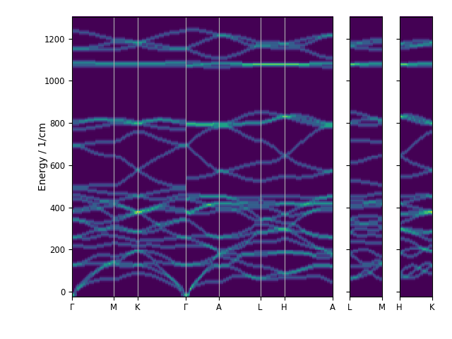
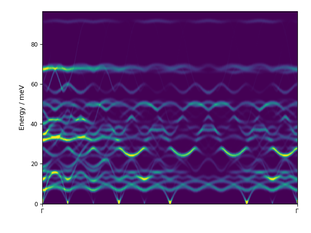

.. _intensity-map-script:

======================
euphonic-intensity-map
======================

.. highlight:: bash

The ``euphonic-intensity-map`` program can be used to plot a 2D intensity
map either along a specific trajectory from precalculated phonon frequencies
and eigenvectors, or along a recommended reciprocal space path from force
constants.

For example, to plot a DOS-weighted intensity map from CASTEP force constants
along a recommended q-point path, in units of 1/cm with an energy broadening of
15 1/cm, one  could run::

   euphonic-intensity-map quartz.castep_bin --weighting dos --energy-unit 1/cm --energy-broadening 15

         and energy on the y axis, showing dos-weighted intensities for quartz.
         It has been broadened by 15 1/cm and the y-axis is in 1/cm.

Or, to plot coherent inelastic neutron scattering intensities from CASTEP phonon frequencies,
with 1000 energy bins and a broadening of 1.5 meV::

   euphonic-intensity-map La2Zr2O7.phonon --weighting coherent --ebins 1000 --energy-broadening 1.5

         and energy on the y axis, showing coherent inelastic neutron scattering
         intensities for La2Zr2O7. It has been broadened by 1.5 meV and the y-axis
         is in default energy units meV.

To see all the command line options, run::

   euphonic-intensity-map -h

You can also see the available command line options below.
For information on advanced plot styling, see :ref:`styling`.

Command Line Options
--------------------

.. argparse::
   :module: euphonic.cli.intensity_map
   :func: get_parser
   :prog: euphonic-intensity-map
