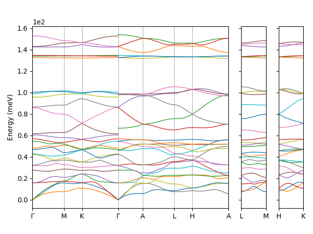

.. _plot_disp:

===================
Plotting Dispersion
===================

Usage
-----

Any ``Data`` object that contains the ``freqs`` attribute can produce a
dispersion plot with the ``plot_dispersion`` function. For phonons, the
frequencies can be reordered to correctly colour branches using the
``reorder_freqs`` method. For example:

.. code-block:: py

    import seekpath
    import numpy as np
    from euphonic.data.interpolation import InterpolationData
    from euphonic.plot.dispersion import plot_dispersion

    # Read quartz data from quartz.castep_bin
    idata = InterpolationData('quartz')

    # Generate a recommended q-point path using seekpath
    _, unique_ions = np.unique(idata.ion_type, return_inverse=True)
    structure = (idata.cell_vec.magnitude, idata.ion_r, unique_ions)
    qpts = seekpath.get_explicit_k_path(structure)["explicit_kpoints_rel"]

    # Calculate frequencies/eigenvectors
    idata.calculate_fine_phonons(qpts, asr='reciprocal')

    # Reorder frequencies
    idata.reorder_freqs()

   # plot_dispersion takes the Data object as an argument and returns a
   # Matplotlib figure
   fig = plot_dispersion(idata)
   fig.show()

By default the figure will split into subplots on gaps in the q-point path,
but this and some other settings can be changed via optional arguments (see 
docstring below). The returned ``matplotlib.figure.Figure`` instance can also be
tweaked directly, for more information see the
`Matplotlib docs <https://matplotlib.org/api/_as_gen/matplotlib.figure.Figure.html#matplotlib.figure.Figure>`_

Docstring
---------
.. autofunction:: euphonic.plot.dispersion.plot_dispersion
