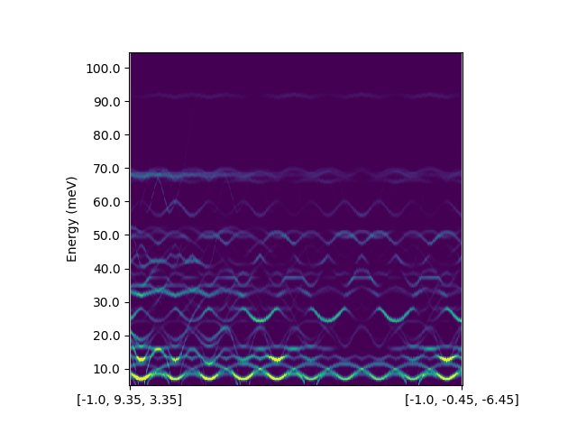

.. _plot_sqw:

====================
Plotting S(Q,w) Maps
====================

Usage
-----

In addition to just calculating the neutron :ref:`structure factor <calc_ins>`
for each branch, a 2D (Q,E) map can be calculated for ``PhononData`` and
``InterpolationData`` objects using the ``calculate_sqw_map`` method, and then
plotted with the ``plot_sqw_map`` function.

.. code-block:: py

    import numpy as np
    from euphonic.data.interpolation import InterpolationData
    from euphonic.plot.dispersion import plot_sqw_map

    # Read LZO data from La2Zr2O7.castep_bin
    idata = InterpolationData('La2Zr2O7')

    # Create a q-point path across multiple Brillouin Zones
    n = 500
    qpts = np.zeros((n, 3))
    qpts[:, 0] = -1.0 # Set qh
    qpts[:, 1] = np.linspace(9.35, -0.45, n) # Set qk
    qpts[:, 2] = np.linspace(3.35, -6.45, n) # Set ql

    # Calculate frequencies/eigenvectors
    idata.calculate_fine_phonons(qpts, asr='reciprocal')

   # Calculate S(Q, w) map. It returns an sqw_map, and gets stored in the
   # sqw_map attribute of the Data object
   scattering_lengths = {'La': 8.24, 'Zr': 7.16, 'O': 5.803}
   ebins = np.arange(5, 105, 0.25)
   sqw_map = idata.calculate_sqw_map(scattering_lengths, ebins,
                                     dw_arg=[5,5,5], T=300)

   # Plot S(Q, w) map. It returns a matplotlib.figure.Figure, and a list of
   # matplotlib.image.AxesImage objects, which can be used to tweak the plot
   fig, ims = plot_sqw_map(idata, ratio=1.0, vmax=5e-9, ewidth=1.0)
   fig.show()

To get a clear plot it will probably be necessary to play with the energy bin
sizes and ``plot_sqw_map`` options, see below.

Docstrings
----------

.. autofunction:: euphonic.data.phonon.PhononData.calculate_sqw_map

.. autofunction:: euphonic.plot.dispersion.plot_sqw_map