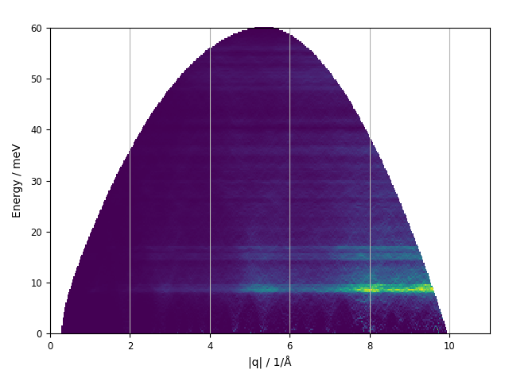

.. _powder-map-script:

======================
euphonic-powder-map
======================

.. contents:: :local:

.. highlight:: bash

Overview
--------

The ``euphonic-powder-map`` program can be used to sample
spherically-averaged properties from force constants data over a range
of :math:`|q|`. The results are plotted as a 2-dimensional map in :math:`(|q|, \omega)`.

For example, to plot a coherent neutron-weighted powder spectrum from CASTEP
force constants over a recommended :math:`|q|` range, one could run::

   euphonic-powder-map quartz.castep_bin --weighting coherent --energy-broadening 1.5

         showing powder-averaged coherent inelastic neutron scattering
         intensities for quartz. Below the intensity map there are also 2
         text boxes labelled 'Max intensity' and 'Min intensity', allowing
         the user to adjust the intensity limits of the plot.

Note the text boxes below the intensity map, which allow the intensity limits of
the plot to be adjusted without having to re-run the expensive powder calculation.
To plot a DOS-weighted intensity from Phonopy force constants over a specified
q range with denser sampling, in THz and with the intensity widget disabled::

   euphonic-powder-map NaCl/phonopy.yaml --weighting dos --energy-unit THz --energy-broadening 0.15 --q-min 0.01 --q-max 4. --q-spacing 0.01 --no-widgets

         and energy on the y axis, showing powder-averaged coherent
         inelastic neutron scattering intensities for NaCl.

To see all the command line options, run::

   euphonic-powder-map -h

You can also see the available command line options at the bottom of this page.
For information on advanced plot styling, see :ref:`styling`.

Progress bars
-------------

Sampling many q-points can be computationally expensive, so a progress
bar will automatically be displayed if `tqdm <https://tqdm.github.io/>`_
is installed

Kinematic constraints
---------------------

Inelastic neutron-scattering measurements have an accessible
:math:`(\mathbf{q}, \omega)` range depending on the instrument
geometry: either the incident energy is fixed (direct geometry) or the
final energy is fixed (indirect geometry), and the scattering angles
are determined by reflector/analyzer/detector positions. The remaining degrees
of freedom (e.g. time-of-flight) are used to determine the
:math:`(\mathbf{q}, \omega)` transfer. To simulate these constraints,
the parameter ``--e-incident`` or ``--e-final`` can be used to set the
constrained energy, and ``--angle-range`` can be used to fix the
detector range. So, for example, to simulate the MARI instrument at
ISIS with a 60 meV incident energy::

  euphonic-powder-map quartz.castep_bin --angle-range 3 135 --e-incident 60 --q-max 11 --energy-unit meV --weights coherent

         and energy on the y axis, showing powder-averaged coherent
         inelastic neutron scattering intensities for quartz. The
         plotting region fills an arc shape, against a white
         background of missing data.

Spherical averaging options
---------------------------

Spherical averaging is performed in a series of constant-q shells. The
``--npts``, ``--npts-density``, ``--npts-min`` and ``--npts-max``
options control the number of samples in each shell, while the
``--sampling`` and ``--jitter`` options control the sampling scheme.
The :ref:`euphonic-show-sampling <sampling-script>` tool can be used
to visualise different sampling schemes.

While the default scheme is recommended for all production
calculations, it is generally necessary to tune the NPTS parameters.
While ``--npts`` sets a constant number of samples for each shell,
``--npts-density`` sets the number of samples at a
1/LENGTH_UNIT-radius sphere, and applies quadratic scaling for other
distances. This may lead to inappropriately small or large numbers of
samples at low or high :math:`|q|`, so the range is limited by
``--npts-min`` and ``--npts-max``. The program will print "Final
npts:" with the number of samples used at the largest sampling
sphere. If this is equal to ``--npts-max`` then the upper limit is in
use; you may wish to experiment with reducing ``--npts-density`` or
increasing ``--npts-max`` in such cases.

Output to file
--------------

The ``--save-json`` option can be used to output the produced
:ref:`Spectrum2D` object as a Euphonic .json file with a specified
name for further use in Euphonic or other programs.

Command Line Options
--------------------

.. argparse::
   :module: euphonic.cli.powder_map
   :func: get_parser
   :prog: euphonic-powder-map
