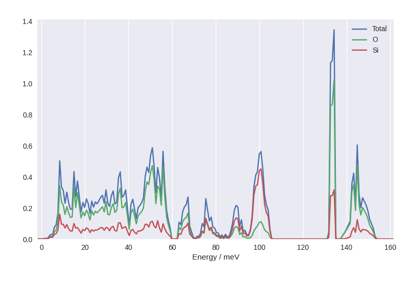
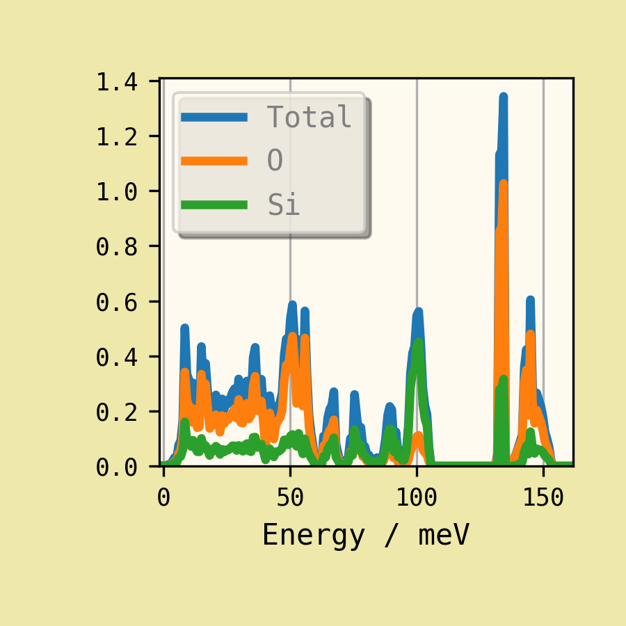
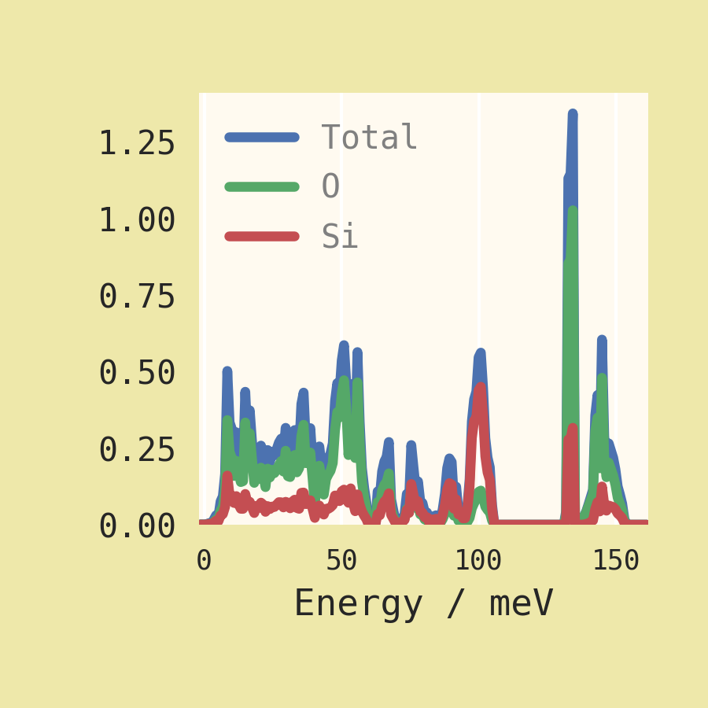

.. _styling:

=================
Customising plots
=================

.. highlight:: bash

Command-line options
====================

Several of Euphonic's :ref:`cl-tools` produce 2D plots. A few command-line
arguments are provided to tweak the plot size, font settings and colour maps, e.g.::

  euphonic-dos --font Monaco --fontsize 18 --figsize 10 10 --figsize-unit cm quartz.castep_bin

will produce a plot with larger (hopefully monospace) text on a small
square canvas. This may be especially useful with the ``--save-to``
option to create consistent plots for presentation slides and academic
papers.

The ``--font`` option will be passed to the Matplotlib library as the
preferred "sans-serif" option, and the font family will be set to
sans-serif. Unfortunately it can be tricky to identify exactly which
font names are accepted by Matplotlib. We cannot advise on this for
all platforms, so if you have a preferred font it may be worth
searching for help on using this font with Matplotlib.

Using Matplotlib styles
=======================

These and other appearance customisations can be defined as a
Matplotlib style sheet.
`A number of popular styles are predefined in Matplotlib <https://matplotlib.org/stable/gallery/style_sheets/style_sheets_reference.html>`_
and may be accessed by name, e.g.::

  euphonic-dos --style seaborn quartz.castep_bin

will yield a plot on a grey background with white gridlines.

        pale grey background divided by white gridlines. There are no
        outlines around the legend (top-right) or the axes; number
        values are in a black sans-serif and float near the plot.

``--style=dark_background`` might be preferred for some slide
presentations. 

Using custom stylesheets
========================

For a custom scheme, you can `develop your own style file <https://matplotlib.org/stable/tutorials/introductory/customizing.html>`_.
For example, with the following file saved as "custom.mplstyle"

.. code-block:: ini

  axes.facecolor: floralwhite
  font.family: monospace
  text.color: grey
  lines.linewidth : 3
  xtick.labelsize : smaller
  legend.fancybox: True
  legend.shadow: True
  figure.figsize : 3, 3
  figure.facecolor : palegoldenrod
  
then the command::

  euphonic-dos quartz.castep_bin --pdos --style custom.mplstyle

generates a small figure with some "opinionated" styling.

        lines, a pale yellow background and pinkish off-white canvas.
        The canvas is surrounded by black lines with numbered ticks.
        On the canvas are vertical grey gridlines and a legend with drop
        shadow, round corners and grey text. The label text is in a
        monospace font.

It is possible to "compose" multiple styles in ascending priority
order, e.g.::

  euphonic-dos quartz.castep_bin --pdos --style seaborn custom.mplstyle

In the resulting figure, the customised text and canvas options have
taken priority, but we still get the Seaborn colour sequence for plot
lines. The plot outline, ticks and legend box were removed. (And with
them, the legend customisation!)

        is gone (along with its shadow), and the line colours are now
        a tasteful blue, green and (desaturated) red combination. The
        grid lines are white against a pale orange background.

For a large project, this can be very useful to establish a general
"house style" with variations for certain plot types. However, as seen
above, combining styles can sometimes have unexpected consequences. In
order to prevent conflict between Euphonic's own stylesheet and other
style options, the ``--no-base-style`` argument can be used to remove
the Euphonic defaults. For example, with the ``seaborn`` style this
will restore the horizontal grid lines that are expected to replace
the missing black ticks.
